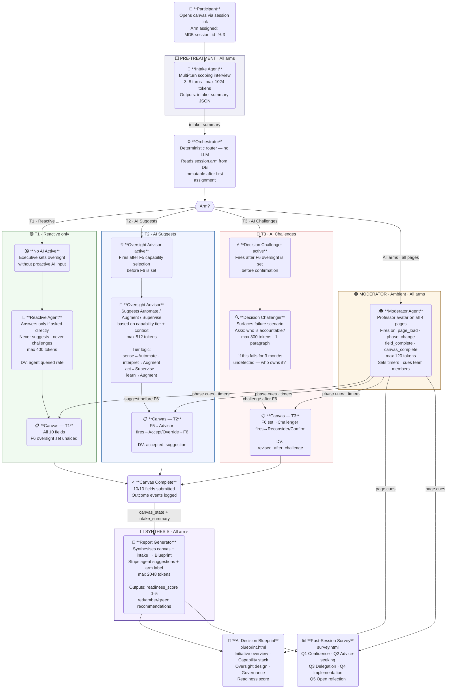

# AItelier · Agentic System — RQ3

> **6 agents · 3 experimental arms · claude-sonnet-4-6**
> A controlled field experiment on AI governance decision-making among executive teams.

---

## Agent Flow Map



---

## Agent Specifications

| # | Agent | File | Arm | Trigger | Max Tokens | Primary Output |
|---|-------|------|-----|---------|-----------|----------------|
| 1 | **Intake** | `agents/intake.py` | All | Pre-canvas · conversation start | 1 024 | `intake_summary` JSON |
| 2 | **Reactive** | `agents/reactive.py` | T1 only | Executive asks a question | 400 | Direct answer |
| 3 | **Oversight Advisor** | `agents/rq3_oversight_advisor.py` | T2 only | F5 capability selected | 512 | `{suggested_level, rationale, display_message}` |
| 4 | **Decision Challenger** | `agents/rq3_decision_challenger.py` | T3 only | F6 oversight level set | 300 | Challenge paragraph |
| 5 | **Moderator** | `agents/moderator.py` | All | page_load · phase_change · field_complete · canvas_complete | 120 | `{message, cue_member?, timer_minutes?}` |
| 6 | **Report Generator** | `agents/report_generator.py` | All | Canvas complete · first blueprint load | 2 048 | Blueprint JSON |

---

## RCT Design

| Arm | Treatment | Agent fires when | Primary DV |
|-----|-----------|-----------------|------------|
| **T1** | Reactive AI only | Executive explicitly asks | `agent.queried` rate |
| **T2** | AI suggests oversight level | After F5 capability selected, before F6 set | `accepted_suggestion` (boolean) |
| **T3** | AI challenges oversight choice | After F6 level set, before confirmation | `revised_after_challenge` (boolean) |

**Arm assignment** — deterministic: `MD5(session_id) % 3 → T1 | T2 | T3`
**Arm isolation** — guidance endpoints return `403` if the session's arm doesn't match.

---

## Key System Prompts

### Intake Agent
> *"Before we open your canvas — tell me about the AI initiative you're here to design. What business problem are you solving, and which team or data would be involved?"*
> Gathers: `problem · domain · data_type · team_size · industry · implementer_roles`
> Never mentions: canvas fields · oversight levels · experimental arms

### Reactive Agent (T1)
> **Absolute constraints:** never suggest an oversight level · never challenge a decision · never volunteer opinions · respond only when explicitly asked · one paragraph maximum

### Oversight Advisor (T2)
> Tier defaults: `sense → Automate` · `interpret → Augment` · `act → Supervise` · `learn → Augment`
> Output format: `SUGGESTED_LEVEL: / RATIONALE: / DISPLAY:`

### Decision Challenger (T3)
> *"You've chosen [level] for [capability]. Before confirming — if this produces a systematic error for 3 months before anyone notices, who is responsible and what's the remediation path? Does that change your choice?"*
> Format: exactly one paragraph · 3–5 sentences · second person · no headers

### Moderator Agent
> *"1–2 sentences maximum. Direct, warm, intellectually sharp. Never lecture — facilitate. Never mention technology explicitly — focus on decisions and accountability."*
> Cue logic: `MD5(page + trigger + phase + fields_done) % len(team_members)` — deterministic

### Report Generator
> **Critical:** Blueprint reflects only participant's own field values — no agent suggestions, no treatment arm label. Outputs `readiness_score 0–5` + `red/amber/green` recommendations.

---

## Canvas Fields

| Phase | Field | Description |
|-------|-------|-------------|
| 1 — Inputs & Context | F0 | Initiative Scope |
| | F1 | Data Inputs |
| | F2 | Human Inputs |
| | F3 | Systems & Infrastructure |
| | F4 | Tacit Constraints |
| 2 — AI Capabilities | F5 | Capability Type ← **T2/T3 intervention point** |
| | F6 | Per-capability Oversight Chains ← **T2/T3 intervention point** |
| 3 — Decision & Oversight | F7 | Feedback Loops |
| | F8 | Business Outcomes & KPIs |
| 4 — Governance | F9 | Governance & Accountability |

---

## Files

```
backend/
  agents/
    intake.py                    # Agent 1 — pre-treatment scoping
    reactive.py                  # Agent 2 — T1 reactive Q&A
    rq3_oversight_advisor.py     # Agent 3 — T2 oversight suggestion
    rq3_decision_challenger.py   # Agent 4 — T3 adversarial challenge
    moderator.py                 # Agent 5 — ambient professor facilitator
    report_generator.py          # Agent 6 — blueprint synthesis
  routers/
    guidance.py                  # Agent hub — intake + arm-specific endpoints
    moderator.py                 # POST /api/moderator/message
    blueprint.py                 # GET /api/blueprint/{session_id}
    sessions.py / canvas.py / events.py / survey.py

frontend/
  moderator.js                   # Moderator IIFE — injected on all 4 pages
  index.html / canvas.html / blueprint.html / survey.html
  config.js                      # window.AITELIER_API

docs/
  README.md                      # This file
  agent-map.html                 # Interactive zoomable map (open locally)
  agents.html                    # Full API + prompt reference
```
